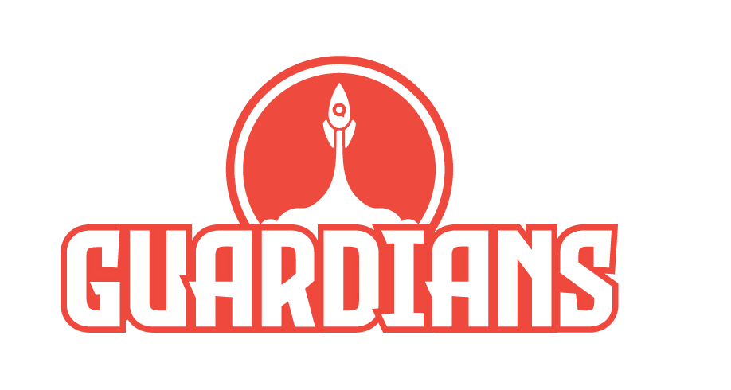

# Croquet Guardians

### [🚀 PLAY IT! 🚀 ](https://croquet.io/guardians/)

_Guardians_ is an open-source cooperative multiplayer game
written by [David A Smith](https://en.wikipedia.org/wiki/David_A._Smith_(computer_scientist))
using the [Croquet Worldcore](https://github.com/croquet/worldcore) game engine.

It features massive numbers of AI bots, taking advantage of
Croquet’s [Synchronized Computation Architecture](https://croquet.io/docs/croquet/) that uses only
client-side code, and where additional bots do not incur additional
network traffic or server load. From a Croquet programmer‘s point of view, there is no server.
All the multiplayer code is contained in this repository and Worldcore's, yet you won't find networking or server code in either.

This is the Web version of _Guardians_, there is also a [Unity port](https://github.com/croquet/croquet-for-unity-guardians).

## The Game

...

## The Lobby

...

## Question

Please ask questions on our [discord](https://croquet.io/discord).
